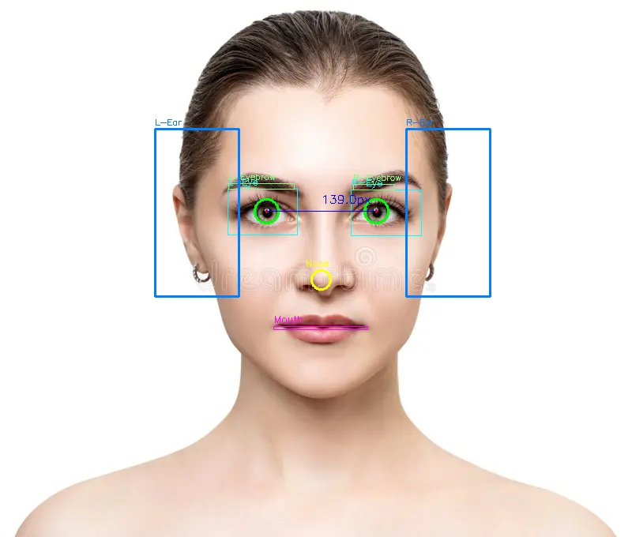
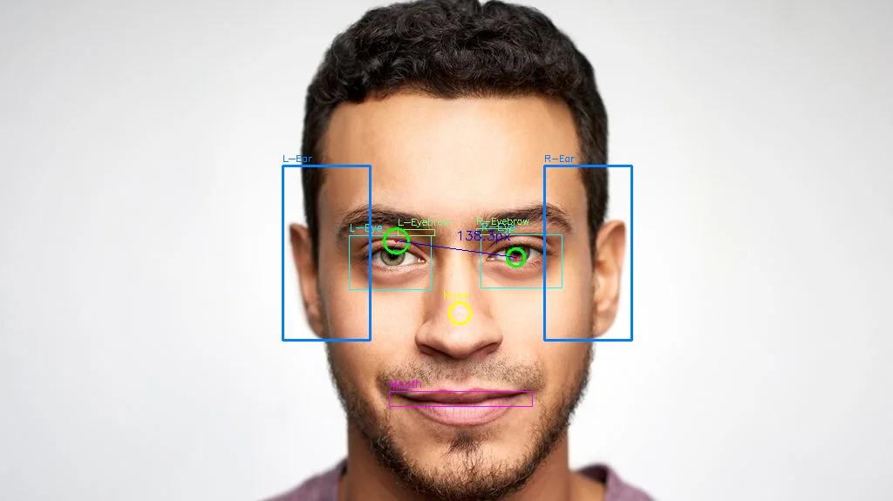
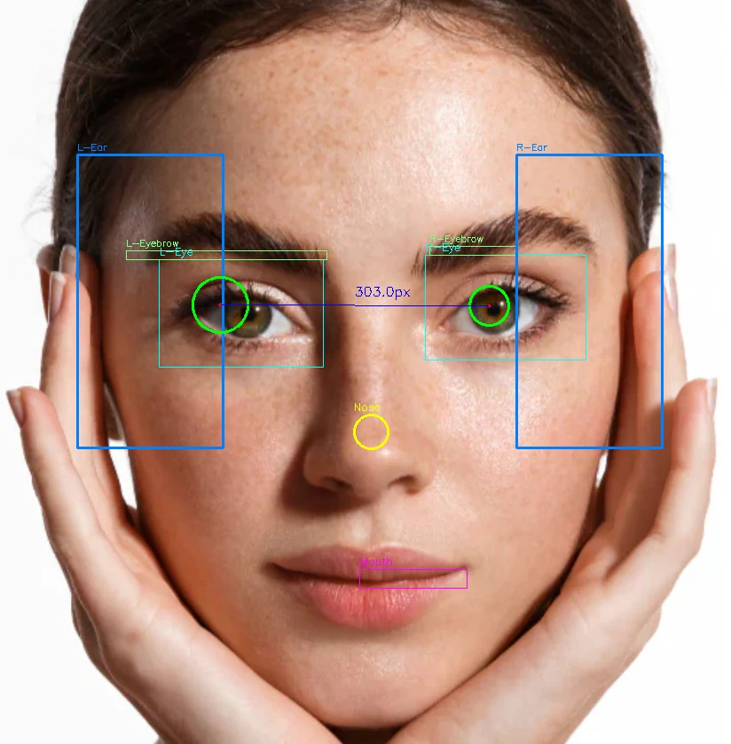
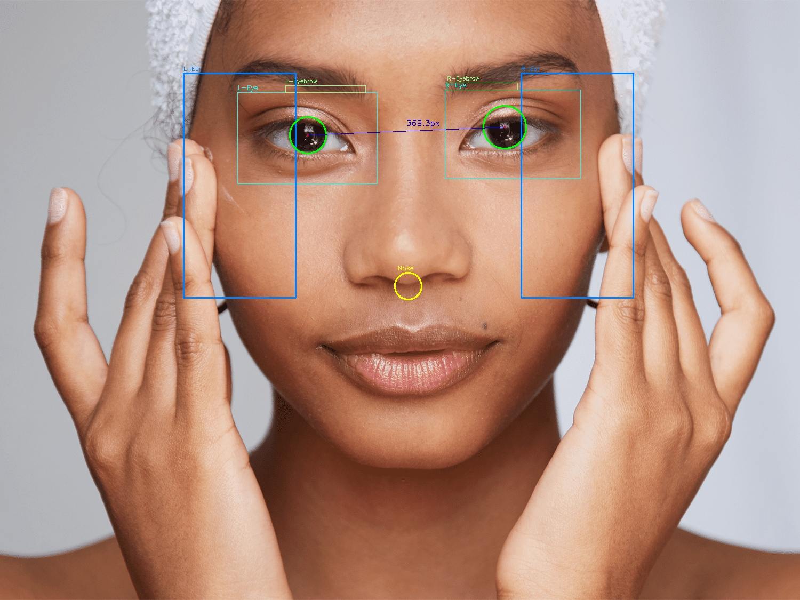
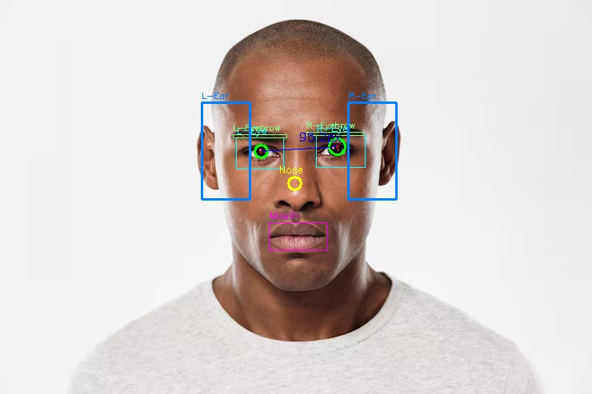
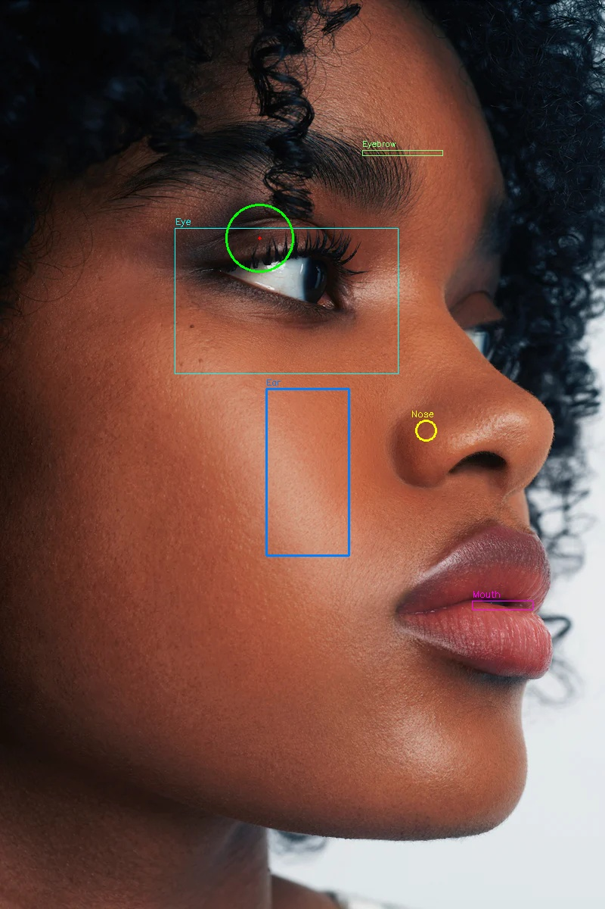
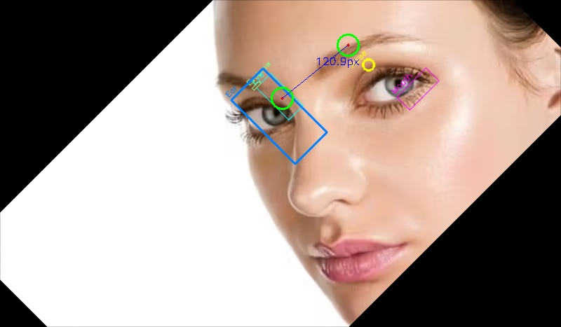

# Pupil Detection (人臉瞳孔偵測與五官定位)

## 題目說明

隨機匯入一張人臉圖片，偵測並標記瞳孔位置與五官位置。需處理以下情境：

- 人物低頭、斜視等姿態變化
- 人臉方向不一定正視前方（側臉、歪頭、旋轉角度）
- 人物遠近距離不同
- 瞳孔反光干擾

## 功能需求

1. **圈出瞳孔範圍** — 在圖片上標記左右眼瞳孔區域
2. **計算兩眼瞳孔中心距離** — 輸出兩瞳孔中心點之間的像素距離
3. **偵測五官位置** — 標記以下五官：
   - 眼睛 (Eyes)
   - 眉毛 (Eyebrows)
   - 鼻子 (Nose)
   - 嘴唇 (Lips/Mouth)
   - 耳朵 (Ears)

## 使用工具

以下影像處理工具（順序不限），以及 OpenCV 內建工具皆可使用：

| 工具 | 說明 |
|------|------|
| Gaussian Blur | 高斯模糊降噪 |
| Binarization | 二值化處理 (含 OTSU 自適應閾值) |
| Sobel | Sobel 邊緣偵測 |
| Canny | Canny 邊緣偵測 |
| Contour | 輪廓偵測 |
| Connected Component Labeling | 連通元件標記 |
| Hough | 霍夫圓偵測 |
| Perspective Transform | 透視變換 |
| Reference Pt | 參考點定位 |
| Haar Cascade | OpenCV 人臉/眼睛分類器 |
| Morphology | 形態學運算 (侵蝕/膨脹/開/閉) |
| Rotation (warpAffine) | 旋轉校正 |

工具可重複多次使用以達成最佳偵測效果。

## 每次執行輸出

程式執行時會列出本次使用的工具順序，例如：

```
Tool order: Perspective Transform -> Reference Pt -> Sobel -> Gaussian Blur -> Binarization -> Connected Component Labeling -> Canny -> Contour -> Hough
```

## 使用方式

```bash
pip install -r requirements.txt
python pupil_detection.py <image_path>
```

支援格式：jpg, png, bmp, webp（安裝 Pillow 可額外支援 avif 等格式）

## 輸出結果

- 標記瞳孔與五官的結果圖片（存為 `result.jpg`）
- 終端輸出兩眼瞳孔中心座標與距離
- 終端輸出五官位置座標

## 處理流程

```
輸入圖片 → 多角度人臉偵測 (正面/側臉/旋轉±45°)
        → 判斷臉部類型 (frontal / profile)
           若偵測到的眼睛 < 2 隻 → 自動切換 profile mode
           使用 Sobel edge density 判斷臉朝向 (左/右)
        → Perspective Transform 校正傾斜
        → Reference Pt 建立眼角參考點
        → Sobel 分析眼區邊緣
        → 眼睛 ROI 擷取 (Haar Cascade, 去除眉毛區域)
        → 瞳孔偵測:
            Gaussian Blur → OTSU Binarization → Erosion
            → Connected Component Labeling (主要)
            → Canny + Contour (輔助)
            → Hough 圓偵測 (備援)
        → 五官偵測 (正臉/側臉分別處理):
            正臉:
              眼睛: Haar Cascade (多分類器)
              眉毛: 基於眼睛中心錨點 + Sobel + Contour (眼睛上方 ~4% 臉高處)
              鼻子: Gaussian Blur + Sobel + Canny + Contour (鼻尖區域)
              嘴唇: Canny + Contour (下半臉水平邊緣)
              耳朵: Sobel + Contour (臉部兩側, 合併輪廓矩形框選)
            側臉:
              眼睛: OTSU Binarization + Contour (臉朝向對側搜尋)
              眉毛: 基於偵測到的眼睛上方搜尋
              鼻子: Sobel + Canny + Contour (臉朝向側邊緣)
              嘴唇: Canny + Contour (鼻子下方偏向臉朝向側)
              耳朵: Sobel + Contour (臉朝向對側, 面向相機處)
        → 繪製結果 + 計算瞳孔距離
```

## 偵測結果展示

### face1 — 正臉



- 左右瞳孔均偵測，眉毛準確標記於眼睛上方
- L-Pupil: (337, 267) r=15，R-Pupil: (476, 267) r=15
- Inter-pupil distance: 139.00 px

```
Tool order: Reference Pt -> Reference Pt -> Sobel -> Gaussian Blur -> Binarization -> Connected Component Labeling -> Canny -> Contour -> Hough -> Gaussian Blur -> Binarization -> Connected Component Labeling -> Canny -> Contour -> Hough -> Gaussian Blur -> Sobel -> Gaussian Blur -> Canny -> Binarization -> Contour -> Gaussian Blur -> Canny -> Contour -> Gaussian Blur -> Binarization -> Contour -> Gaussian Blur -> Binarization -> Contour -> Gaussian Blur -> Sobel -> Binarization -> Contour -> Gaussian Blur -> Sobel -> Binarization -> Contour
```

---

### face2 — 正臉（男性）



- 左右瞳孔均偵測，五官完整標記
- L-Pupil: (454, 276) r=14，R-Pupil: (591, 295) r=10
- Inter-pupil distance: 138.31 px

```
Tool order: Perspective Transform -> Reference Pt -> Reference Pt -> Sobel -> Gaussian Blur -> Binarization -> Connected Component Labeling -> Canny -> Contour -> Hough -> Gaussian Blur -> Binarization -> Connected Component Labeling -> Canny -> Contour -> Hough -> Gaussian Blur -> Sobel -> Gaussian Blur -> Canny -> Binarization -> Contour -> Gaussian Blur -> Canny -> Contour -> Gaussian Blur -> Binarization -> Contour -> Gaussian Blur -> Binarization -> Contour -> Gaussian Blur -> Sobel -> Binarization -> Contour -> Gaussian Blur -> Sobel -> Binarization -> Contour
```

---

### face3 — 正臉近拍



- 左右瞳孔均偵測，雙眼清晰
- L-Pupil: (248, 343) r=31，R-Pupil: (551, 344) r=22
- Inter-pupil distance: 303.00 px

```
Tool order: Reference Pt -> Reference Pt -> Sobel -> Gaussian Blur -> Binarization -> Connected Component Labeling -> Canny -> Contour -> Hough -> Gaussian Blur -> Binarization -> Connected Component Labeling -> Canny -> Contour -> Hough -> Gaussian Blur -> Sobel -> Gaussian Blur -> Canny -> Binarization -> Contour -> Gaussian Blur -> Canny -> Contour -> Gaussian Blur -> Binarization -> Contour -> Gaussian Blur -> Binarization -> Contour -> Gaussian Blur -> Sobel -> Binarization -> Contour -> Gaussian Blur -> Sobel -> Binarization -> Contour
```

---

### face4 — 正臉寬景



- 左右瞳孔均偵測
- L-Pupil: (577, 253) r=34，R-Pupil: (946, 238) r=40
- Inter-pupil distance: 369.30 px

```
Tool order: Reference Pt -> Reference Pt -> Sobel -> Gaussian Blur -> Binarization -> Connected Component Labeling -> Canny -> Contour -> Hough -> Gaussian Blur -> Binarization -> Connected Component Labeling -> Canny -> Contour -> Hough -> Gaussian Blur -> Sobel -> Gaussian Blur -> Canny -> Binarization -> Contour -> Gaussian Blur -> Canny -> Contour -> Gaussian Blur -> Binarization -> Contour -> Gaussian Blur -> Binarization -> Contour -> Gaussian Blur -> Sobel -> Binarization -> Contour -> Gaussian Blur -> Sobel -> Binarization -> Contour
```

---

### face5 — 正臉（禿頭）



- 左右瞳孔均偵測
- L-Pupil: (326, 189) r=8，R-Pupil: (421, 183) r=10
- Inter-pupil distance: 95.19 px
- Nose: (368, 229)（鼻子修正後位置，接近雙眼中點 373.5）

```
Tool order: Reference Pt -> Reference Pt -> Sobel -> Gaussian Blur -> Binarization -> Connected Component Labeling -> Canny -> Contour -> Hough -> Gaussian Blur -> Binarization -> Connected Component Labeling -> Canny -> Contour -> Hough -> Gaussian Blur -> Sobel -> Gaussian Blur -> Canny -> Binarization -> Contour -> Gaussian Blur -> Canny -> Contour -> Gaussian Blur -> Binarization -> Contour -> Gaussian Blur -> Binarization -> Contour -> Gaussian Blur -> Sobel -> Binarization -> Contour -> Gaussian Blur -> Sobel -> Binarization -> Contour
```

---

### face6 — 3/4 側臉（向右）- 依舊無法正確辨識正確




- L-Pupil: (343, 314) — 位於眼睛區域
- Nose: (563, 568) — 標記鼻尖
- R-Pupil: not detected（側臉僅一眼可見，符合預期但辨別位置錯誤）

```
Tool order: Reference Pt -> Reference Pt -> Sobel -> Gaussian Blur -> Binarization -> Connected Component Labeling -> Canny -> Contour -> Hough -> Gaussian Blur -> Binarization -> Contour -> Gaussian Blur -> Sobel -> Gaussian Blur -> Canny -> Binarization -> Contour -> Gaussian Blur -> Canny -> Contour -> Gaussian Blur -> Sobel -> Binarization -> Contour
```

---

### face7 — 側臉 - 



- Face found after rotating -45 deg
- L-Pupil: (402, 140), R-Pupil: (496, 64)
- Inter-pupil distance: 120.88 px

```
Tool order: Reference Pt -> Reference Pt -> Sobel -> Gaussian Blur -> Binarization -> Connected Component Labeling -> Canny -> Contour -> Hough -> Gaussian Blur -> Binarization -> Connected Component Labeling -> Canny -> Contour -> Hough -> Gaussian Blur -> Binarization -> Contour -> Gaussian Blur -> Binarization -> Contour -> Gaussian Blur -> Sobel -> Gaussian Blur -> Canny -> Binarization -> Contour -> Gaussian Blur -> Canny -> Contour -> Gaussian Blur -> Sobel -> Binarization -> Contour
```
